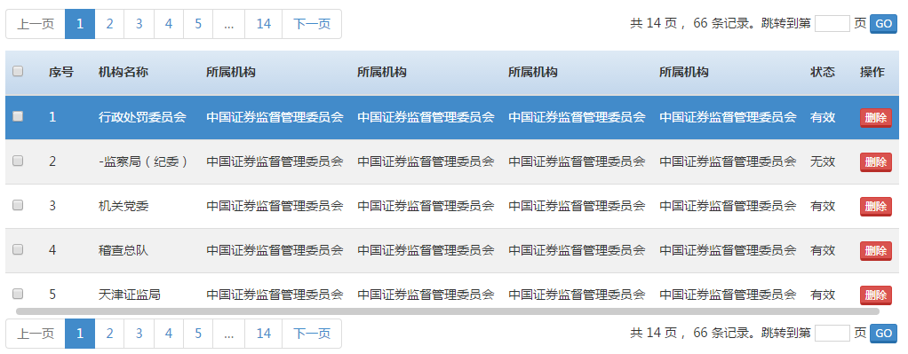

# neris.datatables.js
基于第三方插件 DataTables 封装的一个 jquery 插件，主要是给证监会的项目使用的，保存下来以作纪念！如果这个插件也适合您，同样也可以用！

主要封装的功能点有：
- 自定义显示全选、单选操作
- 自定义索引列
- 复合表头
- 分页显示及位置设置（top、bottom、all）
- 跳转页及输入框合法页数校验
- 是否显示分页
- 自定义每页显示长度
- 是否开启 Loading 动画
- 是否显示横向滚动条
- 国际化
- 服务端模式默认开启
- 目前仅 Bootstap 样式被支持（因为甲方用的都是 Bootstrap 的样式库 --!）

以上功能如果让你感到不爽，欢迎提 Issues!

效果图：


## 依赖

- jQuery 1.12.0+
- DataTables 1.10.15+
- Bootstrap 3.x

## 页面引入
使用插件之前，按照惯例，先把需要的依赖引入，像下面的代码：

```html
<link href="https://maxcdn.bootstrapcdn.com/bootstrap/3.3.7/css/bootstrap.min.css" rel="stylesheet" />
<link rel="stylesheet" href="./assets/dataTables/1.10.15/dataTables.bootstrap.min.css" />
<link rel="stylesheet" type="text/css" href="./assets/mCustomScrollbar/3.1.0/jquery.mCustomScrollbar.css" />

<link rel="stylesheet" type="text/css" href="./dist/neris.datatables.min.css" />

<!-- jquery -->
<script src="./assets/jquery/1.12.0/jquery.js" type="text/javascript"></script>

<!-- dataTables -->
<script src="./assets/dataTables/1.10.15/jquery.dataTables.js" type="text/javascript"></script>
<script src="./assets/dataTables/1.10.15/dataTables.bootstrap.min.js" type="text/javascript"></script>

<!-- 滚动条 -->
<script src="./assets/mCustomScrollbar/3.1.0/jquery.mousewheel.js" type="text/javascript"></script>
<script src="./assets/mCustomScrollbar/3.1.0/jquery.mCustomScrollbar.js" type="text/javascript"></script>

<script src="./dist/neris.datatables.min.js" type="text/javascript" charset="utf-8"></script>

```

## 方法调用
以上所有的 Css、Js 文件引入完毕后，就可以调用插件方法了，像下面的代码：

JavaScript:

```js
$( function () {
	$( "#example" ).nerisDataTables( options );
});
```

Html:

```html
<table id="example1" class="table table-condensed table-striped table-hover" cellspacing="0" width="100%"></table>
```

## options
以下是 options 对象所有的参数列表：

- indexing
Boolean 类型，默认 false，是否显示索引列。

- checking
Boolean 类型，默认 false，是否显示勾选列。

- processing
Boolean 类型，默认 false，是否显示 Loading 动画。

- paging
Boolean 类型，默认 false，是否显示分页。

- pageLength
Number 类型，默认 5 条，每页显示条数。

- pageShow
String 类型，默认 "bottom"，分页栏显示方式。
  - "top" : 在表格顶部显示
  - "bottom" : 在表格底部显示
  - "all" : 表格上下都显示分页

 
- scrollX
Boolean 类型，默认 false，是否显示横向滚动条。

- rowId
String 类型，默认 ""，指定行 id。此属性会为表格中每行的 `tr` 标签设置一个 `id` 属性，属性的值就是 rowId 中指定的内容。可以是普通字符串，也可以是服务端数据中某一个 key。 [参考资料](https://datatables.net/reference/option/rowId)

	例如：

	```js
	// 服务端 JSON 数据
	{
	 ...
	 pageList: [
		{ id: "100", name: "测试1" },
		{ id: "200", name: "测试2" }
	 ]
	 ...
	}

	// rowId
	$("#example").nerisDataTables({
		...
		rowId: "id" // 指定服务端对象中的 id 作为 tr 的 id 值
		...
	});
	```

	最终表格中生成的 `tr` 标签为：
	
	```html
	<tr id="100">...</tr>
	<tr id="200">...</tr>
	```

	**注意：** 当设置 `checking: true` 时，这个选项必须指定，不然会报如下错误：

	```
	when the `checking` option is enabled, you must set the `rowId` option at the same time!
	```


- ajax
String | Object 类型，服务端请求，[参考资料](https://datatables.net/reference/option/ajax)。
	例如：

	```js
	ajax: "./getOrgans" // 默认 GET 请求
	```

	通过  `ajax.type` 属性指定  POST 请求
	
	```js
	$("#example").nerisDataTables({
		...
		ajax: {
			url: "./getOrgans",
			type: "POST"
		}
		...
	});
	```
	
	通过 `ajax.data` 属性传递附加参数
	
	```js
	// 当 data 是 Object 类型时
	$("#example").nerisDataTables({
		...
		ajax: {
			url: "./getOrgans",
			type: "POST",
			data: {
				userId: "100"
			}
		}
		...
	});
	
	// 当 data 是 Function 类型时
	// 在附加参数中，处理一些额外操作：
	$("#example").nerisDataTables({
		...
		ajax: {
			url: "./getOrgans",
			type: "POST",
			data: function ( d ) {
				// 从 Form 表单中获取参数
				d.userId = $("#userId").val()
			}
		}
		...
	});
	```


- columns | `ArrayObject`
ArrayObject 类型，默认 []，控制表格列的显示，[参考资料](https://datatables.net/reference/option/columns)。数组中每个对象完整的选项如下：

	```js
	$("#example").nerisDataTables({
		...
		columns: [
			{
				data: "orgCode", // 服务端 JSON 中对应的 key
				title: "机构代码", // 表头显示的名字
				visible: true, // 设置列是否显示。默认显示
				width: "", // 此参数可用于定义列的宽度，支持任何CSS值（3em，20px，20%等）
				className: "", // 简单来说，这个选项为列中的每个单元格（td）添加一个类
				render: function ( data, type, row ) {
					// data: 单元格的数据，常用。
					// type: 请求调用数据的类型，不常用。
					// row: 行的完整数据，常用。
					
					// 在这里对数据近一步处理：数据格式化、DOM元素绘制等。
					return data;
				}
				
			}
		]
		...
	});
	```
	
	示例代码：
	
	```js
	$("#example").nerisDataTables({
		...
		columns: [
			{ data: "name", title: "机构名称" },
	        { data: "pname", title: "所属机构" },
	        { 
	    	  data: "status", 
	    	  title: "状态" , 
	    	  render: function ( data, type, row ) {
		    	 return data === "0" ? "有效" : "无效";
		      }
	        },
	        { 
	    	  data: null, 
	    	  title: "操作", 
	    	  render: function ( data, type, row ) {
		    	 return "<button class='btn btn-danger btn-xs btn-del' data-id='"+row.id+"'>删除</button>"
		      }
	        }
		]
		...
	});
	```

## 方法

`$( selector ).nerisDataTables( options )` 返回的对象包含以下方法：

| 方法名 | 参数 | 参数类型 | 说明 |
| ----- | --- |  :-----: | --- |
| getSelected | 无 | 无 | 获取选中的数据 |
| setPage | set | String/Number | 设置当前页。当 set 是 String 类型时，只能是：'first','last','next','previous'|

## 请求参数

数据表格组件在初始化数据时，会向服务端发送以下参数：

| 参数名 | 类型 | 默认值 | 说明 |
| --- | --- | --- | --- |
| start | int | 0 | 每页起始值 |
| length | int | 默认等于 pageLength 的值 | 每页条数 |

更多参数配置及说明，请参阅 [server-side#Sent parameters](https://datatables.net/manual/server-side)

## 响应 	JSON 数据
后台相应数据，必须满足以下格式：

```js
{
	draw: 1,
	recordsTotal: 57,
	recordsFiltered: 57,
	data: []
}
```

更多参数配置及说明，请参阅 [server-side#Returned data](https://datatables.net/manual/server-side)


